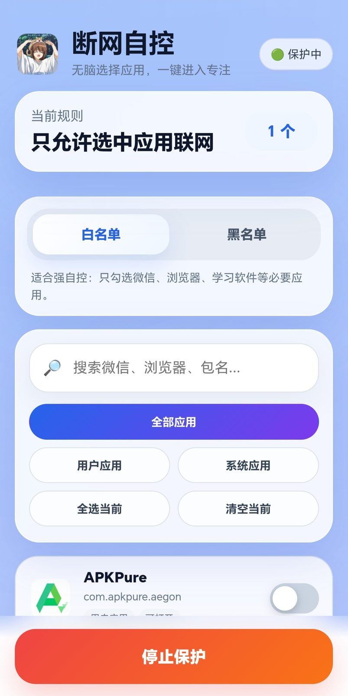

# 断网自控

`断网自控` 是天女目瑛姐姐用 Java 编写的一个 Android 本地 VPN 防火墙，用于通过黑名单/白名单规则限制应用联网，帮助提升自控力哦❤️喜欢的话就给瑛姐姐一个赞吧。



## 功能

- 创建本地 VPN，把受控应用的网络流量导入黑洞并丢弃。
- 支持白名单模式：只允许选中的应用联网，其它应用断网。
- 支持黑名单模式：只禁止选中的应用联网，其它应用正常联网。
- 内置无脑应用选择器，打开即可看到手机应用，可搜索、筛选用户应用/系统应用，不需要手动填写包名。
- 应用读取采用 `getInstalledPackages` + Launcher 查询双通道，尽量覆盖所有已安装应用。
- 使用 WebView + HTML/CSS/JS 实现前端界面，包含玻璃拟态卡片、渐变按钮、底部固定单按钮、应用开关列表。
- 应用列表会显示真实应用图标，顶部也显示本应用真实图标，图标不再额外叠加彩色底板。
- 启动图标来自项目内图片，已压缩生成多密度 `ic_launcher.png`。
- Java 代码尽量使用中文命名；WebView 暴露给 JS 的少量桥接方法保留英文，以保证兼容性。
- 前台服务通知与通知渠道，通知图标使用应用图标，降低开启后闪退概率。
- 进入即门禁：通知权限、忽略电池优化、VPN 授权、读取应用列表四项全部完成后才能进入主界面，每次回到前台都会重新检测，防止用户中途关闭权限。
- 多重保活：前台常驻通知、任务被划掉自动重启、被系统杀死后自动重启、开机/应用更新/网络变化后按上次状态恢复保护。
- 主界面提供可选的“设置应用自启动”入口，自动识别小米/华为/OPPO/vivo/OnePlus 等厂商跳转对应自启页（该项系统无法检测，故不纳入强制门禁）。

## APK

已编译 APK 位于：

```text
已编译APK/断网自控.apk
```

## 使用方法

1. 安装 `已编译APK/断网自控.apk`。
2. 首次进入会出现授权门禁页，依次完成四项授权（通知权限、忽略电池优化、VPN 授权、读取应用列表），全部变绿后点“进入断网自控”。
3. 选择 `白名单` 或 `黑名单` 模式。
4. 搜索并勾选需要控制的应用。
5. 点击“开启保护”即可生效。
6. 可选：主界面底部有“设置应用自启动”入口，部分手机开启后可进一步防止被杀后台。

## 项目结构

```text
app/src/main/java/com/duanwangzikong/   Java 源码
app/src/main/assets/www/                 WebView 前端页面
app/src/main/res/                        图标、颜色、样式资源
docs/应用演示.jpg                         README 演示图
已编译APK/断网自控.apk                    已编译 APK
构建脚本.sh                              命令行构建脚本
```

## 命令行构建

本项目可以不用 Android Studio，通过命令行构建：

```bash
bash 构建脚本.sh
```

当前本地构建链说明：

- Java 编译使用 Android SDK API 35 的 `android.jar`，以便引用较新的 Android API。
- 资源打包使用系统 ARM 版 `aapt2/aapt/zipalign` 和 API 23 平台包，因为 Google 官方 Build Tools 是 x86_64 Linux 二进制，当前 ARM proot 环境无法直接执行。
- APK 目标版本保持 `targetSdk 28`，这样前台 VPN 服务兼容性更稳。

## 注意

- Android 同一时间通常只能使用一个 VPN，所以它会和 Clash、WireGuard、AdGuard VPN 等冲突。
- 这是自控工具，不是企业级防火墙；你仍可从系统设置关闭 VPN。
- 若想更强约束，建议配合系统应用锁锁住“设置”和“断网自控”。
- `QUERY_ALL_PACKAGES` 权限适合自用和开源学习；如果上架应用商店，需要按平台政策说明用途。

## 📝 开源协议

本项目采用 **AGPL v3** 协议开源。

任何人可以自由使用、修改和分发本项目，但修改后的版本也必须以 AGPL v3 协议开源，且通过网络提供服务时也必须公开源代码。

详情请参阅 [LICENSE](LICENSE) 文件。